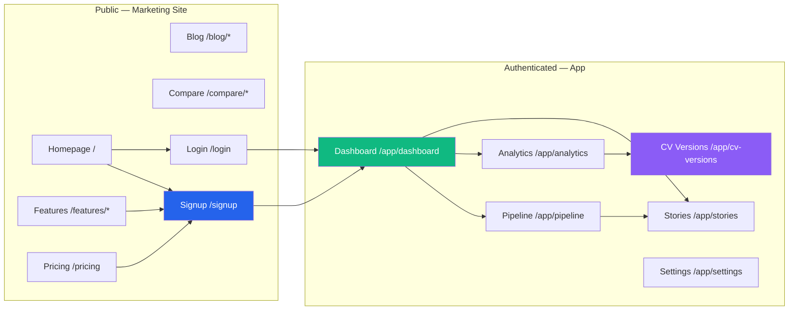
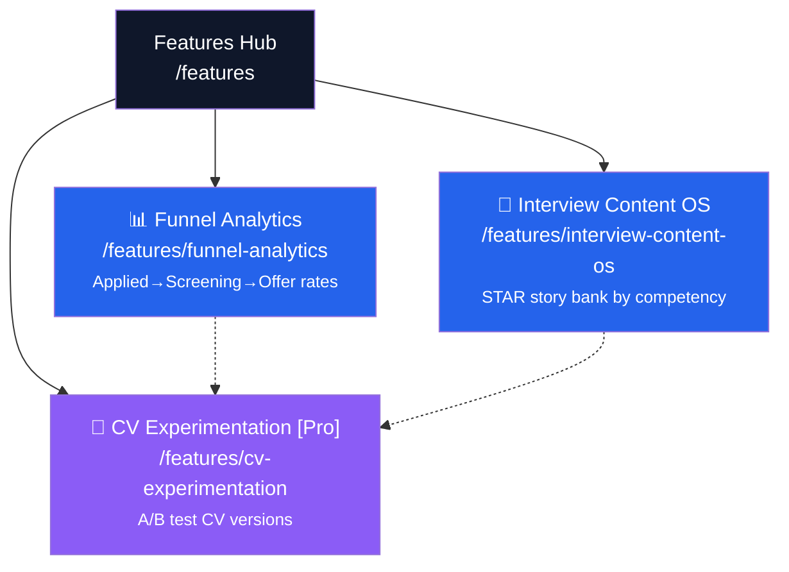
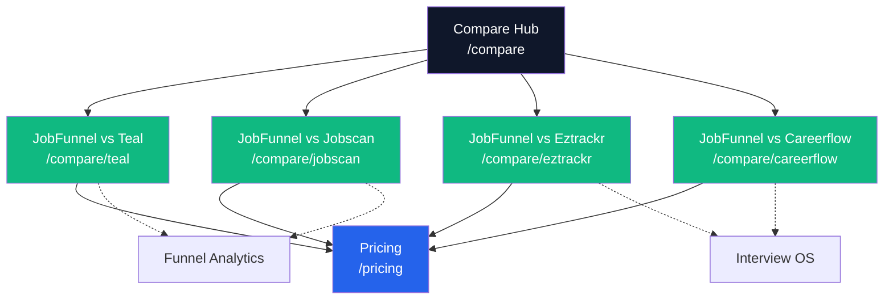
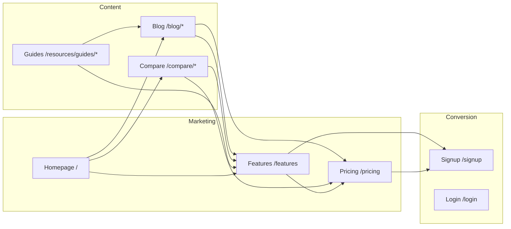
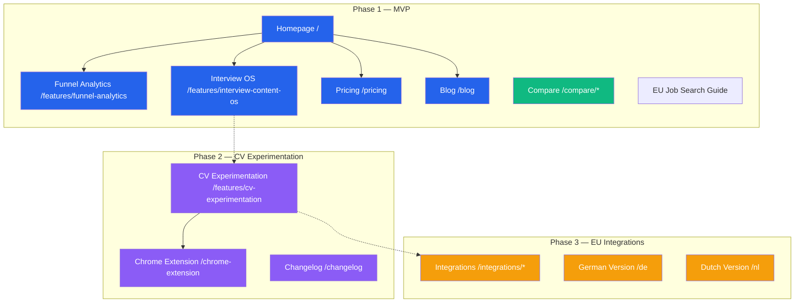
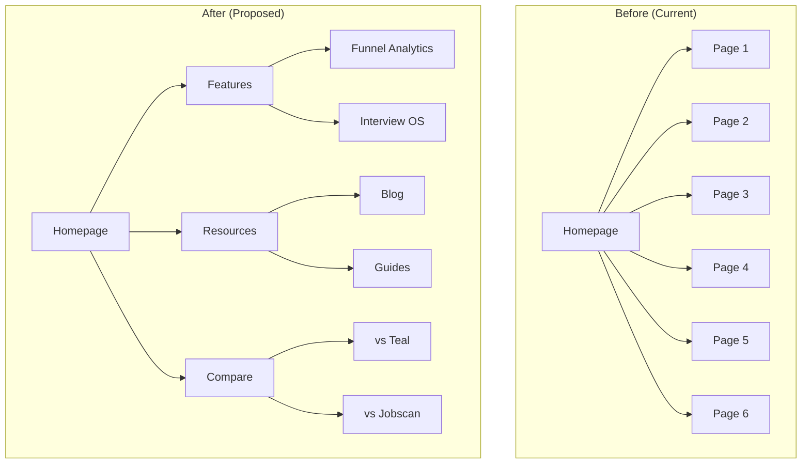

# Mermaid Diagram Templates — JobFunnel OS

Copy-paste-ready Mermaid diagrams for JobFunnel's marketing site structure. Uses the official JobFunnel color palette. Customize node labels and connections as the site evolves.

---

## JobFunnel Full Marketing Site Hierarchy

Complete sitemap with nav zones and JobFunnel brand colors.

```mermaid
graph TD
    subgraph "Header Nav"
        HOME["Homepage<br/>/"]
        FEAT["Features<br/>/features"]
        PRICE["Pricing<br/>/pricing"]
        BLOG["Blog<br/>/blog"]
        COMPARE["Compare<br/>/compare"]
        CTA["Get Started Free ★<br/>/signup"]
    end

    subgraph "Three Pillars — Feature Pages"
        F1["📊 Funnel Analytics<br/>/features/funnel-analytics"]
        F2["📖 Interview Content OS<br/>/features/interview-content-os"]
        F3["🧪 CV Experimentation [Pro]<br/>/features/cv-experimentation"]
    end

    subgraph "Compare Pages — SEO Priority"
        C1["vs Teal<br/>/compare/teal"]
        C2["vs Jobscan<br/>/compare/jobscan"]
        C3["vs Eztrackr<br/>/compare/eztrackr"]
        C4["vs Careerflow<br/>/compare/careerflow"]
    end

    subgraph "Content"
        B1["Blog Index<br/>/blog"]
        B2["EU Tech Market<br/>/blog/category/eu-tech-market"]
        B3["Interview Prep<br/>/blog/category/interview-prep"]
        B4["CV & Applications<br/>/blog/category/cv-applications"]
        B5["Job Search Strategy<br/>/blog/category/job-search-strategy"]
        G1["EU Job Search Guide<br/>/resources/guides/eu-job-search"]
        G2["STAR Method Guide<br/>/resources/guides/star-method"]
    end

    subgraph "Footer Only"
        ABOUT["About<br/>/about"]
        PRIVACY["Privacy<br/>/privacy"]
        TERMS["Terms<br/>/terms"]
        GDPR["GDPR ✓<br/>/gdpr"]
    end

    HOME --> FEAT
    HOME --> PRICE
    HOME --> BLOG
    HOME --> COMPARE
    FEAT --> F1
    FEAT --> F2
    FEAT --> F3
    COMPARE --> C1
    COMPARE --> C2
    COMPARE --> C3
    COMPARE --> C4
    BLOG --> B1
    B1 --> B2
    B1 --> B3
    B1 --> B4
    B1 --> B5
    HOME --> G1
    HOME --> G2
    HOME --> ABOUT

    style CTA fill:#2563EB,color:#fff
    style F1 fill:#2563EB,color:#fff
    style F2 fill:#2563EB,color:#fff
    style F3 fill:#8B5CF6,color:#fff
    style C1 fill:#10B981,color:#fff
    style C2 fill:#10B981,color:#fff
    style C3 fill:#10B981,color:#fff
    style C4 fill:#10B981,color:#fff
    style GDPR fill:#F59E0B,color:#fff
```



Color key for JobFunnel diagrams:
- **Blue** (`#2563EB`): Core pages, primary CTAs, Phase 1 features
- **Purple** (`#8B5CF6`): Pro-only features, Phase 2 pages
- **Green** (`#10B981`): Compare pages (high-intent SEO), conversion pages
- **Amber** (`#F59E0B`): Required pages (GDPR, legal), Phase 2 planned pages
- **Red** (`#EF4444`): Pages to remove or deprecate

---

## Marketing Site vs App — Two-Zone Diagram

Shows the clear separation between public marketing and authenticated app.



---

## Three-Pillar Feature Hub

Shows the three strategic pillars as a hub-and-spoke from the Features section.



Legend:
- Solid lines = primary feature hub links
- Dashed lines = cross-feature upsell links (Phase 2 links from Phase 1)

---

## Competitor Compare Pages

Shows compare pages as SEO spokes off the Compare hub.



Legend:
- Solid lines = primary nav flow (compare → pricing)
- Dashed lines = contextual internal links (compare → feature page)

---

## Content Hub-and-Spoke Model

Three content clusters mapped to the three pillars.

```mermaid
graph TD
    subgraph "Cluster 1: Funnel Analytics"
        H1["Hub: Funnel Analytics Guide<br/>/resources/guides/funnel-analytics"]
        S1A["Job Search Metrics That Matter<br/>/blog/job-search-metrics"]
        S1B["Applied-to-Screening Rate Explained<br/>/blog/applied-to-screening-rate"]
        S1C["How Long Should a Job Search Take<br/>/blog/how-long-job-search"]
    end

    subgraph "Cluster 2: Interview Prep"
        H2["Hub: STAR Method Guide<br/>/resources/guides/star-method"]
        S2A["Competency Interviews in Europe<br/>/blog/competency-interviews-europe"]
        S2B["STAR Method Examples<br/>/blog/star-method-examples"]
        S2C["Behavioral Interview Prep<br/>/blog/behavioral-interview-prep"]
    end

    subgraph "Cluster 3: EU Job Market"
        H3["Hub: EU Job Search Guide<br/>/resources/guides/eu-job-search"]
        S3A["Job Search in Germany<br/>/blog/job-search-germany"]
        S3B["Job Search in Netherlands<br/>/blog/job-search-netherlands"]
        S3C["Cross-Border EU Applications<br/>/blog/cross-border-eu-jobs"]
    end

    H1 --> S1A
    H1 --> S1B
    H1 --> S1C
    S1A -.-> S1B
    S1B -.-> S1C

    H2 --> S2A
    H2 --> S2B
    H2 --> S2C
    S2A -.-> S2B

    H3 --> S3A
    H3 --> S3B
    H3 --> S3C
    S3A -.-> S3B

    style H1 fill:#2563EB,color:#fff
    style H2 fill:#2563EB,color:#fff
    style H3 fill:#2563EB,color:#fff
```



Legend:
- Solid lines = hub → spoke links (hub page links to each spoke)
- Dashed lines = spoke cross-links (spokes link to each other where relevant)
- All spokes also link back to their hub (not shown for clarity)

---

## Internal Linking Flow (Marketing Site)

Shows how different sections link to each other for SEO equity flow.



---

## Phase Roadmap Diagram

Shows which pages are Phase 1 (shipped) vs Phase 2 (planned).



---

## Before / After — Site Restructuring Template

Use this when planning a navigation change. Replace placeholder labels with actual pages.



---

## Color Coding Reference

Use these styles consistently across all JobFunnel Mermaid diagrams:

```
Phase 1 / Core pages:      style NODE fill:#2563EB,color:#fff   ← Primary blue
Pro / Phase 2 features:    style NODE fill:#8B5CF6,color:#fff   ← Purple
Compare / Conversion:      style NODE fill:#10B981,color:#fff   ← Green
Planned / Phase 3:         style NODE fill:#F59E0B,color:#fff   ← Amber
Deprecated / To remove:    style NODE fill:#EF4444,color:#fff   ← Red
Footer-only / Legal:       style NODE fill:#64748B,color:#fff   ← Gray
```

---

## Related Files

- [site-architecture.md](site-architecture.md) — Full hierarchy, URL map, internal linking strategy
- [navigation-patterns.md](navigation-patterns.md) — Header, footer, mobile, breadcrumb patterns
- [site-type-templates.md](site-type-templates.md) — Full page hierarchy templates
