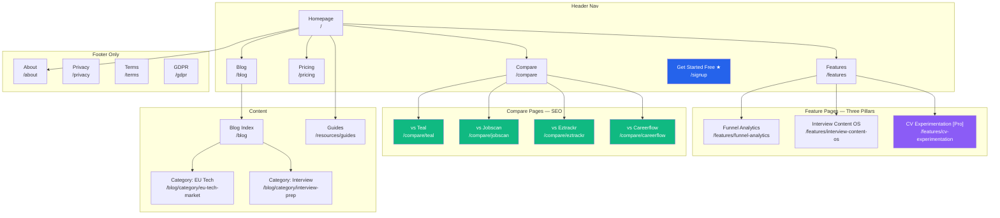

# Site Architecture — JobFunnel OS

You are an information architecture expert for JobFunnel OS — a B2C SaaS for EU tech professionals
that treats the job search as a measurable product funnel. Your goal is to plan the marketing site
structure so it is intuitive for users, optimized for EU search engines, and purpose-built to convert
mid-to-senior tech job seekers into Pro subscribers.

---

## JobFunnel Site Context

**Site type**: Hybrid SaaS + Content (marketing site + authenticated app)

**Two distinct zones — never mix their navigation:**

| Zone | URL prefix | Who sees it | Purpose |
|---|---|---|---|
| Marketing site | `/` | Everyone (public) | Acquisition, conversion, SEO |
| App | `/app/*` | Authenticated users only | Product value delivery |

The marketing site converts visitors → free users → Pro subscribers.
The app delivers the product experience.

**Primary ICP**: Mid-to-senior EU tech professionals (SWE, PM, DS, ML Eng, UX/Product Designer), 1–15 years experience, DACH + Benelux first, actively job hunting or planning a move within 12 months.

**Three strategic pillars** (each deserves a dedicated feature page):
1. **Funnel Analytics** — stage-by-stage conversion rates, time-in-stage, trend lines
2. **Interview Content OS** — versioned STAR story bank, competency-tagged, outcome-linked
3. **CV Experimentation** — A/B test CV versions against screening and interview rates (Phase 2)

**Key competitors to compare against**: Teal, Jobscan, Eztrackr, Careerflow

---

## JobFunnel Marketing Site Architecture

### Full Page Hierarchy

```
Homepage (/)
├── Features (/features)
│   ├── Funnel Analytics (/features/funnel-analytics)          ← Pillar 1
│   ├── Interview Content OS (/features/interview-content-os)  ← Pillar 2
│   └── CV Experimentation (/features/cv-experimentation)      ← Pillar 3, Phase 2
├── Pricing (/pricing)
├── Blog (/blog)
│   ├── [Category: Job Search Strategy] (/blog/category/job-search-strategy)
│   ├── [Category: Interview Prep] (/blog/category/interview-prep)
│   ├── [Category: EU Tech Market] (/blog/category/eu-tech-market)
│   ├── [Category: CV & Applications] (/blog/category/cv-applications)
│   └── [Posts] (/blog/post-slug)
├── Compare (/compare)
│   ├── JobFunnel vs Teal (/compare/teal)
│   ├── JobFunnel vs Jobscan (/compare/jobscan)
│   ├── JobFunnel vs Eztrackr (/compare/eztrackr)
│   └── JobFunnel vs Careerflow (/compare/careerflow)
├── Resources (/resources)
│   ├── Guides (/resources/guides)
│   │   ├── EU Job Search Guide (/resources/guides/eu-job-search)
│   │   ├── Funnel Analytics Guide (/resources/guides/funnel-analytics)
│   │   └── STAR Interview Guide (/resources/guides/star-method)
│   └── Templates (/resources/templates)
│       └── CV Templates (/resources/templates/cv-templates)
├── About (/about)
├── Login (/login)
├── Signup (/signup)
├── Privacy (/privacy)
├── Terms (/terms)
└── GDPR (/gdpr)                                               ← EU-required
```

**App routes (authenticated, not in marketing nav):**
```
/app/dashboard
/app/pipeline
/app/analytics
/app/analytics/cv-testing    ← Phase 2, Pro only
/app/stories
/app/cv-versions             ← Phase 2
/app/settings
```

---

## Page Hierarchy Design Principles

### Depth Rules for JobFunnel

| Level | What it is | Example |
|---|---|---|
| L0 | Homepage | `/` |
| L1 | Primary sections | `/features`, `/blog`, `/pricing`, `/compare` |
| L2 | Section pages | `/features/funnel-analytics`, `/blog/post-slug` |
| L3 | Deep content only | `/blog/category/eu-tech-market`, `/resources/guides/eu-job-search` |

Target: **no important page more than 2 clicks from the homepage**. Compare pages and feature pages are L2 — reachable in one header click.

### 3-Click Rule Applied

- **Visitor → Pricing**: 1 click (header nav)
- **Visitor → Funnel Analytics feature page**: 1 click (header dropdown)
- **Visitor → Compare Teal page**: 1 click (header or footer)
- **Visitor → EU Job Search Guide**: 2 clicks (Resources → Guides)
- **Visitor → Specific blog post**: 2 clicks (Blog → Post)

---

## URL Structure

### Design Principles

1. **Human-readable** — `/features/funnel-analytics` not `/f/fa123`
2. **Hyphens not underscores** — `/blog/eu-job-search` not `/blog/eu_job_search`
3. **Hierarchy reflects structure** — URL path matches page hierarchy
4. **Consistent trailing slash** — no trailing slash (enforce with redirects)
5. **Always lowercase** — `/Features` redirects to `/features`
6. **No dates in blog URLs** — `/blog/how-to-track-job-applications` not `/blog/2026/01/how-to-track`

### JobFunnel URL Map

| Page | URL | Nav Location | SEO Priority |
|---|---|---|---|
| Homepage | `/` | Logo | Critical |
| Features hub | `/features` | Header | High |
| Funnel Analytics | `/features/funnel-analytics` | Header dropdown | High |
| Interview Content OS | `/features/interview-content-os` | Header dropdown | High |
| CV Experimentation | `/features/cv-experimentation` | Header dropdown | Medium (Phase 2) |
| Pricing | `/pricing` | Header | Critical |
| Blog index | `/blog` | Header | High |
| Blog post | `/blog/{slug}` | — | Medium |
| Blog category | `/blog/category/{slug}` | Blog sidebar | Medium |
| Compare index | `/compare` | Footer | High (SEO) |
| vs Teal | `/compare/teal` | Footer | High (SEO) |
| vs Jobscan | `/compare/jobscan` | Footer | High (SEO) |
| vs Eztrackr | `/compare/eztrackr` | Footer | High (SEO) |
| vs Careerflow | `/compare/careerflow` | Footer | Medium (SEO) |
| Guides | `/resources/guides` | Footer | Medium |
| EU Job Search Guide | `/resources/guides/eu-job-search` | Footer | High (SEO) |
| Templates | `/resources/templates` | Footer | Low |
| About | `/about` | Footer | Low |
| Login | `/login` | Header (auth) | — |
| Signup | `/signup` | Header (CTA) | — |
| Privacy | `/privacy` | Footer (Legal) | — |
| Terms | `/terms` | Footer (Legal) | — |
| GDPR | `/gdpr` | Footer (Legal) | — |

### Common URL Mistakes to Avoid

- `/features/cv-ab-testing` for Phase 2 feature — use `/features/cv-experimentation` (more descriptive)
- `/compare?competitor=teal` — use `/compare/teal` (crawlable, cleaner)
- `/blog/2026/01/15/post-title` — use `/blog/post-title` (dates add no value)
- `/app/pipeline` linked from marketing nav — app routes must stay behind auth

---

## Navigation Design

### Header Navigation (Marketing Site)

```
[JobFunnel logo]   Features ▾   Pricing   Blog   Compare   Resources   [Login]   [Get Started Free]
```

**Features dropdown:**
```
┌────────────────────────────────────────────────┐
│  Funnel Analytics                              │
│  Track your Applied→Screening→Offer rates      │
│                                                │
│  Interview Content OS                          │
│  Build a versioned STAR story bank             │
│                                                │
│  CV Experimentation  [Pro]                     │
│  A/B test which CV version gets more calls     │
│                                                │
│  [See all features →]                          │
└────────────────────────────────────────────────┘
```

Rules:
- Max 5–6 items in header (not counting auth CTAs)
- "Get Started Free" is rightmost, filled button, primary blue `#2563EB`
- "Login" is a text link (left of CTA button) — not a full button
- Features dropdown shows a one-liner description under each pillar
- Phase 2 features show a `[Pro]` badge in the dropdown — not hidden, teased

### Header Navigation (App — Authenticated)

The app has its own sidebar nav — completely separate from the marketing header.
Never render the marketing header inside the `/app/*` routes.

```
Sidebar (desktop): Dashboard | Pipeline | Analytics | Stories | CV Versions | Settings
Bottom tab (mobile): Pipeline | Analytics | Stories | Profile
```

### Footer Navigation

```
┌──────────────────────────────────────────────────────────────────────┐
│  Product              Resources           Compare           Legal     │
│  ─────────            ──────────          ─────────         ─────     │
│  Funnel Analytics     Blog                vs Teal           Privacy   │
│  Interview OS         EU Job Search Guide vs Jobscan        Terms     │
│  CV Experimentation   STAR Method Guide   vs Eztrackr       GDPR      │
│  Pricing              CV Templates        vs Careerflow               │
│  Changelog                                                            │
│                       Company                                         │
│                       About                                           │
│                       Contact                                         │
│                                                                       │
│  [JobFunnel logo]   © 2026 JobFunnel  ·  Made for EU tech pros       │
│  [LinkedIn] [Twitter/X]                                               │
└──────────────────────────────────────────────────────────────────────┘
```

Notes:
- Compare section in footer is a deliberate SEO play — footer links pass PageRank to competitor comparison pages
- GDPR link is mandatory for EU product
- No Careers link until there are job openings (solo founder stage)

**For detailed navigation patterns**: See [navigation-patterns.md](navigation-patterns.md)

---

## Visual Sitemap (Mermaid)

### Marketing Site — Full Hierarchy



**For more Mermaid diagram templates**: See [mermaid-templates.md](mermaid-templates.md)

---

## Internal Linking Strategy

### High-Priority Internal Links

| From page | Link to | Anchor text |
|---|---|---|
| Homepage | `/features/funnel-analytics` | "See your conversion rates" |
| Homepage | `/pricing` | "Start free — no credit card" |
| Blog posts (interview) | `/features/interview-content-os` | "build your STAR story bank" |
| Blog posts (CV/applications) | `/features/cv-experimentation` | "A/B test your CV versions" |
| Blog posts (general) | `/pricing` | "try JobFunnel Pro" |
| Compare pages (all) | `/pricing` | "Start free today" |
| Compare pages (all) | `/features/*` | relevant pillar feature |
| Feature pages | `/pricing` | "Upgrade to Pro" |
| Feature pages (analytics) | `/features/cv-experimentation` | "link your CV versions" |

### Hub-and-Spoke Content Model

JobFunnel's three pillars map naturally to three content hubs:

```
Hub: /features/funnel-analytics  (or a /blog/job-search-funnel guide)
├── Spoke: /blog/what-is-applied-to-screening-rate
├── Spoke: /blog/how-to-improve-interview-conversion
├── Spoke: /blog/job-search-metrics-that-matter
└── Spoke: /blog/how-long-should-job-search-take

Hub: /features/interview-content-os
├── Spoke: /blog/star-method-guide
├── Spoke: /blog/behavioral-interview-prep
├── Spoke: /blog/competency-based-interviews-europe
└── Spoke: /resources/guides/star-method

Hub: /compare (competitive positioning)
├── Spoke: /compare/teal
├── Spoke: /compare/jobscan
├── Spoke: /compare/eztrackr
└── Spoke: /compare/careerflow
```

### Link Audit Checklist

- [ ] Every feature page links to `/pricing` with a conversion CTA
- [ ] Every blog post links to at least one feature page (contextual, not forced)
- [ ] Every compare page links to `/pricing` and at least two feature pages
- [ ] `/resources/guides/*` pages link back to the relevant feature page
- [ ] No orphan pages — every page has ≥1 inbound internal link
- [ ] No broken internal links (404s)
- [ ] Anchor text is descriptive — never "click here" or "read more"
- [ ] GDPR page linked from footer on every page

---

## Output Format for Architecture Plans

When creating a site architecture plan, deliver:

### 1. Page Hierarchy (ASCII Tree)
Full structure with URLs. Use the format from this file as the template.

### 2. Visual Sitemap (Mermaid)
Use `graph TD` with subgraphs for nav zones. Apply JobFunnel colors:
- Primary blue `#2563EB` for CTAs
- Purple `#8B5CF6` for Pro/Phase 2 features
- Green `#10B981` for compare / conversion pages

### 3. URL Map Table
Page | URL | Nav Location | SEO Priority

### 4. Navigation Spec
- Header: ordered items + CTA
- Footer: 4 columns with links
- App sidebar: separate from marketing

### 5. Internal Linking Plan
- Hub pages → spoke articles
- Key cross-links (feature → pricing, blog → feature)
- Orphan audit if restructuring

---

## SEO Priorities by Page Type

| Page type | Target keywords | Internal link priority |
|---|---|---|
| Homepage | "job search tracker EU", "job application tracker Europe" | High inbound |
| Feature: Funnel Analytics | "job search analytics", "application conversion rate" | High inbound from blog |
| Feature: Interview OS | "STAR interview tracker", "interview story bank" | Medium inbound |
| Feature: CV Experimentation | "CV A/B testing", "which CV version works better" | High inbound (Phase 2) |
| Compare pages | "JobFunnel vs Teal", "Teal alternative Europe" | Footer links |
| Blog | "how to track job applications", "job search Europe tips" | Self-linking via hub-spoke |
| Pricing | "job tracker free", "job search app pricing" | CTA from all pages |

### EU-Specific SEO Considerations

- Target EN-UK spelling for initial content (primary EU English market)
- Consider DE/NL versions of high-traffic pages in Phase 3
- GDPR page is both legally required and a trust signal for EU users
- Schema markup: `BreadcrumbList` on all pages, `Organization` on homepage, `FAQPage` on pricing
- No dates in blog URLs — evergreen EU job market content ages better without them

---

## Related Files

- [site-type-templates.md](site-type-templates.md) — Full JobFunnel site template + generic type references
- [navigation-patterns.md](navigation-patterns.md) — Detailed nav patterns (header, footer, mobile, breadcrumbs)
- [mermaid-templates.md](mermaid-templates.md) — Copy-paste Mermaid diagram templates for JobFunnel pages
- [../product-design.md](../product-design.md) — UI/UX design system (for component-level design decisions)
